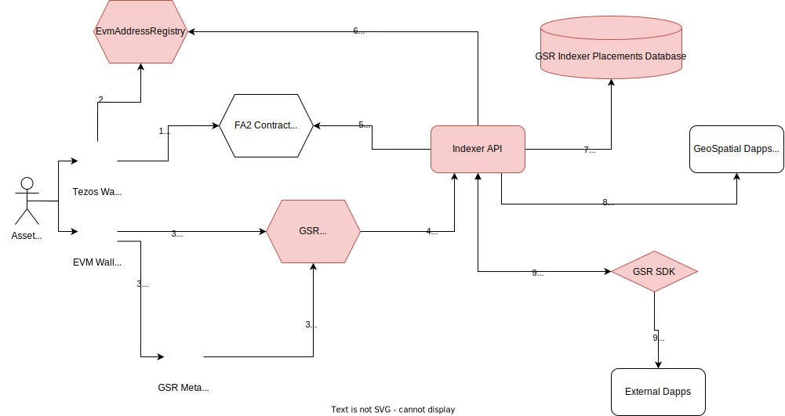

# GSR data flow

The GSR is a smart contract designed to take digital assets from any chain or centralized storage system, and allow owners to record a location and configure a scene for the asset.

See the diagram for a walkthrough of the placing flow.

See the Litepaper for the full description. However in short, this is the expected flow:

1. An Owner purchases a digital asset
1. The Owner constructs an `EncodedAssetId` by abiEncoding the identifier for their asset (perhaps chainId/contractId/tokenId)
1. The Owner constructs a `GeoHash` describing the area they want their asset to be placed
1. The Owner decides if their placement should have a start or end time.
1. The Owner calls `place(encodedAssetId, geohash, timeRange)`
1. If the underlying asset does not have a 3D scene associated with it, or the owner wants to show a more complex scene at this placement, they can alternatively call `placeWithScene(encodedAssetId, geohash, timeRange, sceneUri)`, passing in a URL to look up the scene configuration and other metadata about the placement.
1. Either way, the smart contract hashes the `EncodedAssetId` into a small `bytes32 assetId`, and records the placement for that `assetId`, according to the sender's address.
1. This also emits a `GsrPlacement` event, which has the `encodedAssetId`, the `assetId`, and all other placement and scene data.
1. An Indexer service can react to this placement event, and decode the `EncodedAssetId` (based on the `assetType`) into values it can use to query the appropriate blockchain for the current owner of the asset, and compare that to the publisher. If the current owner is different, it can ignore the placement event. Otherwise it should record the placement in a database for later display or querying.

## On-chain Querying

1. If another user wants to check the current placement of the asset, they first query the appropriate blockchain for the asset's owner, and then query the GSR for the placement of that asset (according to the owner), by calling `placeOf(assetId, publisher)`, sending the hashed `assetId` and the owner's address. This will return the geohash of the asset, plus the time it has been there since.
1. If another smart contract wants to check if an asset is located within a specific area, it can call `inWithin(boundingGeohash, assetId, publisher)` to see if the asset (according to the publisher, which should be verified first) is within a larger geohash.

## Assets inside other assets

Other than supporting placing single assets, the GSR also supports placing assets inside of other assets. This allows multiple owners to collaborate on a single scene by publicly removing their asset from the world, and making it available to another asset to ethically use in its scene.

To do this:

1. The owner of an asset uses `place()` to place it in the world
1. The owner of another asset uses `placeWithin` to move their piece into another asset's location.
1. `placeWithin` will fail if the target asset is already within another asset, as this would otherwise allow infinite loops and expensive lookups.
1. The owner of the first asset may then use `updateSceneUri` to update their scene to be one that uses the newly placed asset, as well as the original asset.
1. Data consumers may then choose to display the scene as "verified", as the owner of the second asset has allowed their asset to be used.
1. Query functions like `placeOf` and `isWithin` for the second asset will return the location of the primary asset.
1. `isInsideAsset` also exists to check if an asset is currently inside of another specific asset.

## Meta-transactions

To allow marketplaces to allow gasless GSR placements for their NFTs, the GSR also supports signed meta-transactions. The meta-transaction implementation is based on [OpenSea's sample metatransaction contracts](https://github.com/ProjectOpenSea/meta-transactions/blob/main/contracts/ERC721MetaTransactionMaticSample.sol).

A user may, instead of directly sending a transaction like `place()` to the GSR contract, instead construct an object of the function they want to call and the arguments they want to send, then sign that message (along with some other information like a nonce and the GSR's address). Then any address may choose to submit that meta-transaction signature on behalf of the original signer, and the GSR will process it as if the original signer had submitted the transaction.

For an example of setting up a meta-transaction, see the `accepts metaTransactions` test in `packages/contracts/test/GeoSpatialRegistry.test.ts`
